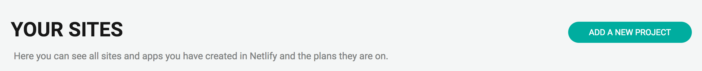
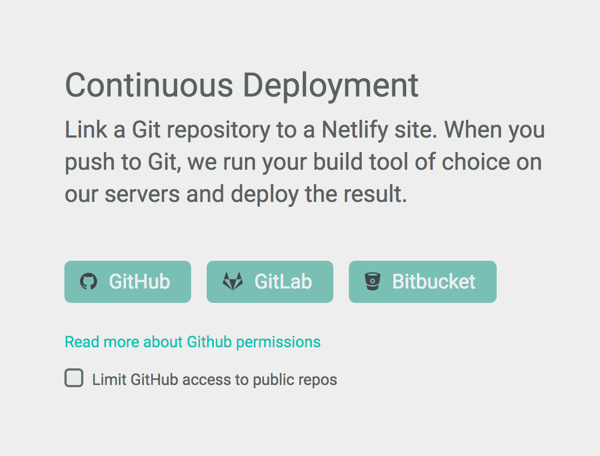
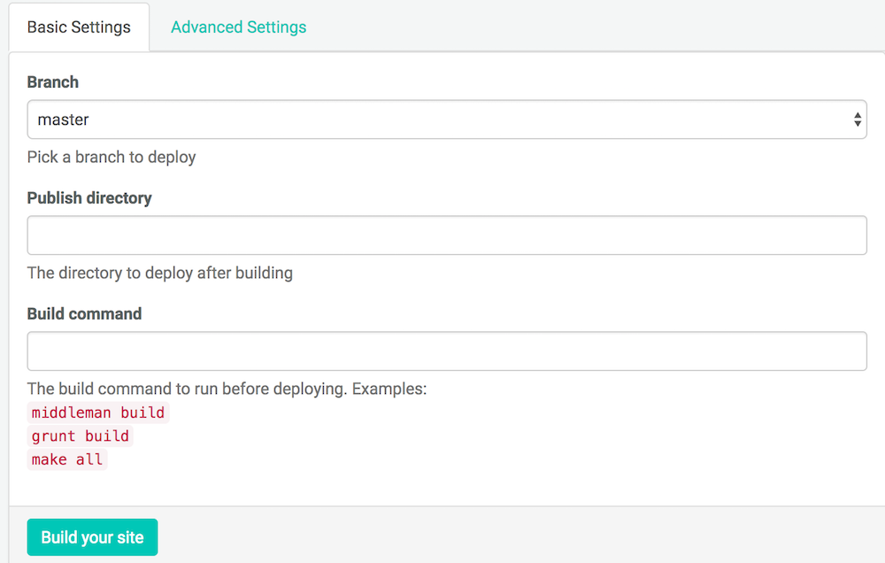
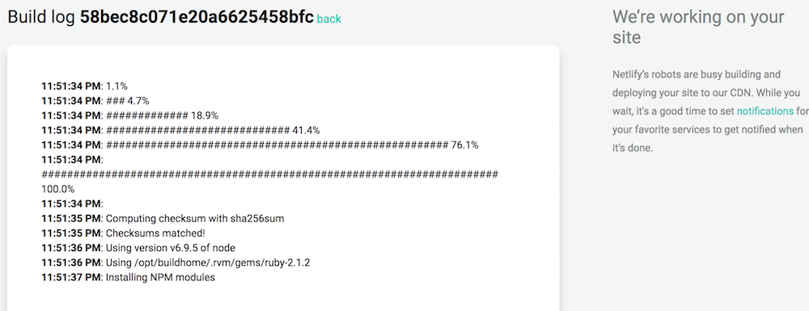
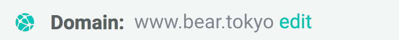
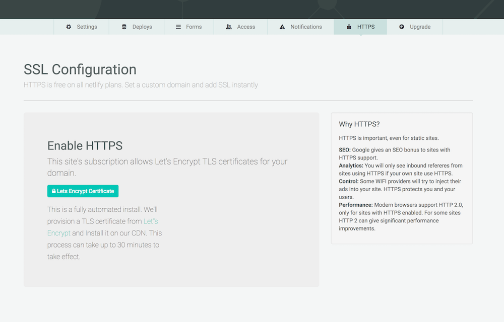

# GatsbyとNetlify

## [Gatsby](https://github.com/gatsbyjs/gatsby)

- React製の静的サイトジェネレーター

## [Netlify](https://www.netlify.com/)

- 静的なサイトのホスティングサービス
- Githubと連携してPushしたら自動でデプロイ
- 無料でHTPPS
- SPA向けのプリレンダリングなど(有料)


# 作り方

## Gatsbyをインストールする

npmでGatsbyをグルーバルインストールする

```bash
$ npm install -g gatsby
```

## Gatsbyプロジェクトを作成する

```bash
$ gatsby new hoge https://github.com/gatsbyjs/gatsby-starter-blog
```

今回はブログを作るため、 `https://github.com/gatsbyjs/gatsby-starter-blog` を指定する

何も指定しない場合には https://github.com/gatsbyjs/gatsby-starter-default になる

↑が完了すると `hoge` ディレクトリが出来ているので移動する

```bash
$ gatsby develop
```

上記のコマンドを実行することでサーバーが立ち上がってブラウザから `http://0.0.0.0:8000` などで確認することが出来る


## Node.jsのバージョンを指定する

```bash
node -v > .nvmrc
```

Netlifyでは任意のNode.jsのバージョンを使用できるので `.nvmrc` で指定する


## Gitのリポジトリを作成する

NetlifyでGitと連携してデプロイするため適宜レポジトリを作成しておく


## NetlifyとGitを連携する

[CLI](https://github.com/netlify/netlify-cli)からも行えるが今回はブラウザを使用した

1. 新しいプロジェクトを追加する



2. Githubと連携する



Githubをクリックするとオーソライズ画面が出るので承認する

3. デプロイの設定をする



承認が完了するとリポジトリの選択画面に遷移するので該当するものを選択する

### デプロイの設定

- `Branch`
  - 適宜(master等)
- `Publish directory`
  - `/public`
  - ↑gatsbyのビルドのデフォルトの出力先
- `Build command`
  - `gatsby build --prefix-links`
  - `--prefix-links` は `config.toml` で設定した `linkPrefix` を有効にしたい場合に必要

## ビルド



デプロイ設定ページで `save` をクリックするとサイトがビルドされブラウザで確認出来るようになる


# その他

詳細については下記 `参考` リンクを参照

## カスタムドメインに変更



1. カスタムドメインを取得しておく

2. DNSの設定をする


今回であれば `www.bear.tokyo` のため

- Subdomain
  - www
- Type
  - CNAME
- Value
  - bear.netlify.com

のように設定した

## HTTPSに変更



画像のページで `Let's Encrypt Certificate` をクリックするだけで完了


## リダイレクト

1. `Publish directory` の `/public` に `_redirect` ファイルを作成する
2. 今回は `www.bear.tokyo/blog` 配下をブログとして表示したかったので `_redirect` を以下のように設定した

```_redirect
/ /blog/ 301
/blog/* /:splat 200
```

## プリレンダリング

- 無料プラン以外のプランで使える
- BASICプランなら9ドルで契約できるがそんなに更新するかわからないので様子見


# 今後の予定

- `gatsby-starter-blog` のままなので何かCSSフレームワークをあてる
- Reactの部分も少しカスタマイズしていく


# 参考

- [A Step\-by\-Step Guide: Gatsby on Netlify \| Netlify](https://www.netlify.com/blog/2016/02/24/a-step-by-step-guide-gatsby-on-netlify/)
- [Custom Domains \| Netlify](https://www.netlify.com/docs/custom-domains/)
- [SSL / HTTPS \| Netlify](https://www.netlify.com/docs/ssl/)
- [Redirects & Rewrites \| Netlify](https://www.netlify.com/docs/redirects/)
- [Prerendering \| Netlify](https://www.netlify.com/docs/prerendering/)